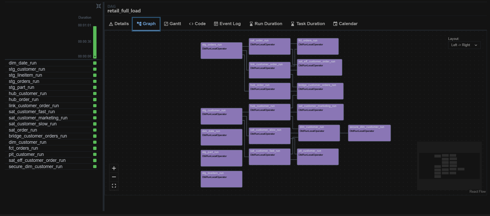
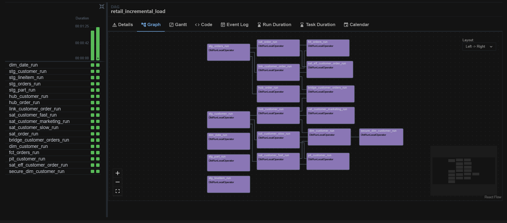
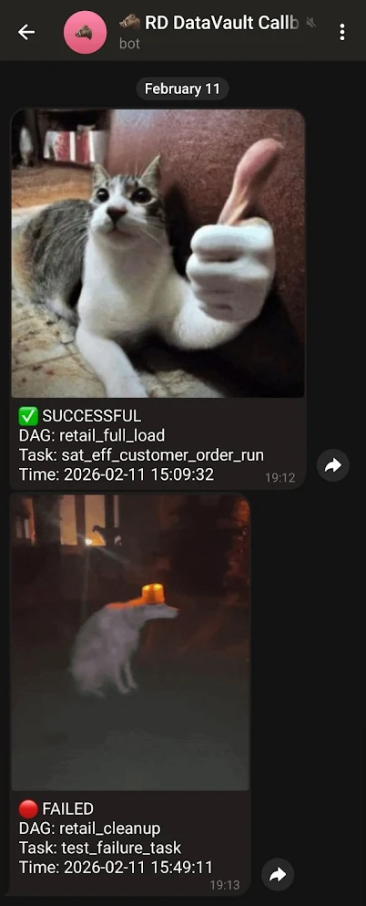
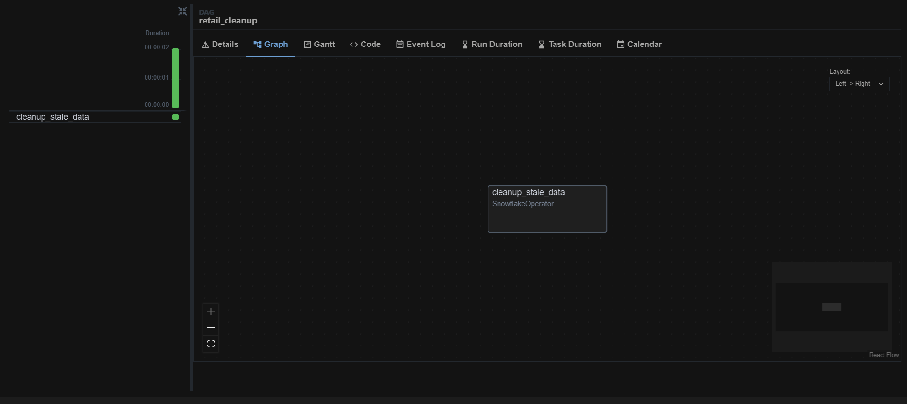

# Retail Data Vault: End-to-End ELT Pipeline

## Project Overview

This project implements a scalable ELT pipeline based on the **Data Vault 2.0** methodology. It processes retail data from staging to consumption-ready data marts using the Modern Data Stack. The architecture is designed for high performance, historical tracking, and security, fully containerized using Docker.

The pipeline transforms raw data into a flexible Raw Vault, optimizes it via a Business Vault, and presents it through Star Schema Information Marts with Row Level Security (RLS).

## Architecture & Technology Stack

The solution utilizes a Monorepo structure orchestrating the following technologies:

| Component | Technology | Description |
| :--- | :--- | :--- |
| **Warehouse** | **Snowflake** | Cloud data warehouse for storage and compute. |
| **Transformation** | **dbt Core** | SQL-based transformation logic, testing, and documentation. |
| **Orchestration** | **Apache Airflow** | Workflow management using **Cosmos** to render dbt projects as DAGs. |
| **Environment** | **Docker** | Containerization of Airflow and dbt environments. |
| **Package Mgmt** | **uv** | Fast Python package installer and resolver. |
| **CI/CD** | **GitHub Actions** | Automated linting (SQLFluff, Ruff) and security scanning (TruffleHog). |

---

## Data Model & Layers

The Snowflake database is organized into strictly defined layers, satisfying the architectural requirements of the technical specification.

### 1. Staging Layer (`PUBLIC_STAGING`)
* **Purpose:** Initial data ingestion and preparation.
* **Implementation:** View-based materialization to minimize storage.
* **Features:** Hashing of business keys (MD5/SHA) to generate surrogate keys for Data Vault.

### 2. Raw Vault (`PUBLIC_RAW_VAULT`)
* **Purpose:** Historical storage of data based on Data Vault 2.0 standards.
* **Components:**
    * **Hubs:** Unique lists of business keys (e.g., `HUB_CUSTOMER`, `HUB_ORDER`).
    * **Links:** Transactions and associations (e.g., `LINK_CUSTOMER_ORDER`).
    * **Satellites:** Contextual data with history tracking.
* **Optimization (TR: Performance):** Split satellites into **Fast** (frequently changing) and **Slow** (static) variants (e.g., `SAT_CUSTOMER_FAST`, `SAT_CUSTOMER_SLOW`) to reduce data redundancy.

### 3. Business Vault (`PUBLIC_BUSINESS_VAULT`)
* **Purpose:** Query acceleration and business logic application.
* **Components:**
    * **Bridge Tables:** Pre-joined keys to resolve many-to-many relationships and eliminate complex joins in downstream layers (e.g., `BRIDGE_CUSTOMER_ORDERS`).
    * **Point-in-Time (PIT) Tables:** Optimization for joining historical satellite data.

### 4. Information Marts (`PUBLIC_MARTS`)
* **Purpose:** Consumer-facing Star Schema (Facts and Dimensions).
* **SCD Type 2 (TR: SCD2 Logic):** Dimension tables implement `MERGE` strategies to track historical changes (`VALID_FROM` logic) derived from the underlying vault.
* **Security (TR: RLS):** Implementation of **Secure Views** (e.g., `SECURE_DIM_CUSTOMER`) to restrict data access based on Snowflake Roles (`ACCOUNTADMIN` vs `PUBLIC`).

---

## Key Features & Requirements Implementation

### 1. Orchestration & Automation
**Requirement Satisfied:** *Automated orchestration via Airflow; usage of Cosmos.*
* The project uses **Cosmos** to automatically parse the dbt project structure and generate Airflow DAGs.
* **DAGs Implemented:**
    * `retail_full_load`: Orchestrates Full Refresh and initial historical loads.
    * `retail_incremental_load`: Daily incremental processing.
    * `retail_cleanup`: Maintenance tasks.

### 2. Security & Secrets Management
**Requirement Satisfied:** *No hardcoded secrets; Environment variable usage.*
* All sensitive credentials (Snowflake passwords, API tokens) are managed via `.env` files and passed to containers as **Airflow Connections** (`AIRFLOW_CONN_SNOWFLAKE_DEFAULT`).
* No secrets are stored in the codebase or Docker images.

### 3. Monitoring & Alerting
**Requirement Satisfied:** *Notification system for pipeline status.*
* Custom Airflow callbacks are implemented to send real-time notifications to **Telegram**.
* Alerts include DAG status (Success/Failure), execution time, and log links.

### 4. Code Quality & CI/CD
**Requirement Satisfied:** *CI pipeline with linting and security checks.*
* **GitHub Actions Workflow:**
    * **Security:** `TruffleHog` scans commit history for leaked secrets.
    * **Linting:** `Ruff` ensures Python code quality; `SQLFluff` enforces SQL style guides for dbt models.
    * **Integrity:** `dbt parse` verifies project structure on every push.

### 5. Resilience & Recovery
**Requirement Satisfied:** *Data recovery mechanisms (Time Travel).*
* Scripts utilize Snowflake **Time Travel** features (`AT(OFFSET => ...)` and `UNDROP`) to demonstrate recovery from accidental data deletion or table drops.

---

## Project Structure

```text
dbt_core/models/
├── staging/                # 1. Raw staging with hash calculation
│   ├── customer/
│   ├── orders/
│   └── ...
├── raw_vault/              # 2. The Core Vault
│   ├── hubs/               # Business Keys
│   ├── links/              # Relationships
│   └── sats/               # Descriptive History (SCD2)
├── business_vault/         # 3. Business Logic
│   └── sat_eff_...         # Effectivity Satellites (Logic for closing dates)
└── marts/                  # 4. Consumer Layer (Star Schema)
    ├── dim_customer.sql    # SCD Type 2 Dimension
    ├── fct_orders.sql
    └── ...
```

## Execution Results

The following screenshots demonstrate the successful execution of the pipeline and monitoring systems.

### 1. Full Load Execution
Successful execution of the Full Load DAG, initializing the Data Vault.


### 2. Incremental Load Execution
Daily processing of new data, utilizing dbt incremental materialization.


### 3. Monitoring & Alerts
Real-time notifications delivered to Telegram upon task completion.


### 4. Cleanup & Maintenance
Execution of maintenance routines.


---

## Setup & Installation

### Prerequisites
* Docker Desktop & Docker Compose
* Snowflake Account

### Installation Steps

1.  **Clone the Repository:**
    ```bash
    git clone <repository-url>
    cd retail_vault
    ```

2.  **Configuration:**
    Fill in the values in the `.env` template provided in the root directory:
    ```bash
    AIRFLOW_CONN_SNOWFLAKE_DEFAULT='snowflake://<user>:<password>@<account>/<db>/<schema>?warehouse=<wh>&role=<role>'
    TELEGRAM_TOKEN='<your_bot_token>'
    TELEGRAM_CHAT_ID='<your_chat_id>'
    ```
    You have to create your own telegram bot and get the token and chat id from the botfather if you wish to receive the notifications.

3.  **Build and Run:**
    ```bash
    docker-compose up --build -d
    ```

4.  **Access Airflow:**
    Navigate to `http://localhost:8080` and trigger the `retail_full_load` DAG.